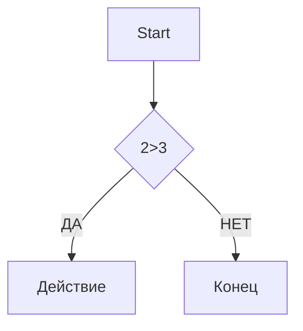

# test1

#Заголовок

####Заголовок

#########Заголовок

############Заголовок

###############Заголовок

Выделение текста
----------------

*Курсив* / _Курисив_

***Жирный и Курсив*** / __Жирный и курсив__

~~зачеркнутый~~

`моноширный код`

Списки
------

- Пункт 1
- Пункт 2
 -Вложенный
  - еще
    * Пункт 3
    + Пункт 4
1. Первый
2. Второй
3. Третий
 1. Вложенный
 2. Еще
- [x] 1
- [ ] 2
- [ ] 3

Ссылки
------

[текст ссылки](https://example.com)

[с подсказкой](https://example.com "При наведении")

<https://auto.link.com>

[Ссылочный стиль].[1]
[1]: https://auto.link.com


Картинки
--------


[](https://www.novosibklimat54.ru/goods/80516730-betonosmesitel_st_200_200_litrov_1000_vt)

Цитата
------

>Цитата
>Много строк
>
>>Вложенная

Код
---

```markdown
print("Hello") python

```python

c = a+b
print("hello")

```
Таблицы
-------

---: = ориентация справа

:---: ориентация по центру

:--- = ориентация слева

| Name | Age | City   |
|-----:|:---:|:-------|
|SS    |34   |  Mod   |
|SS    |34   |  Mod   |
|SS    |34   |  Mod   |
|SS    |34   |  Mod   |


Экранирование
-------------

\#fsds

\[ fsdfdsfsdf \]

Диаграмма
---------



Заголовки
---------

- [Заголовки](#1-заголовки)
- [Списки](#3-списки)
  


